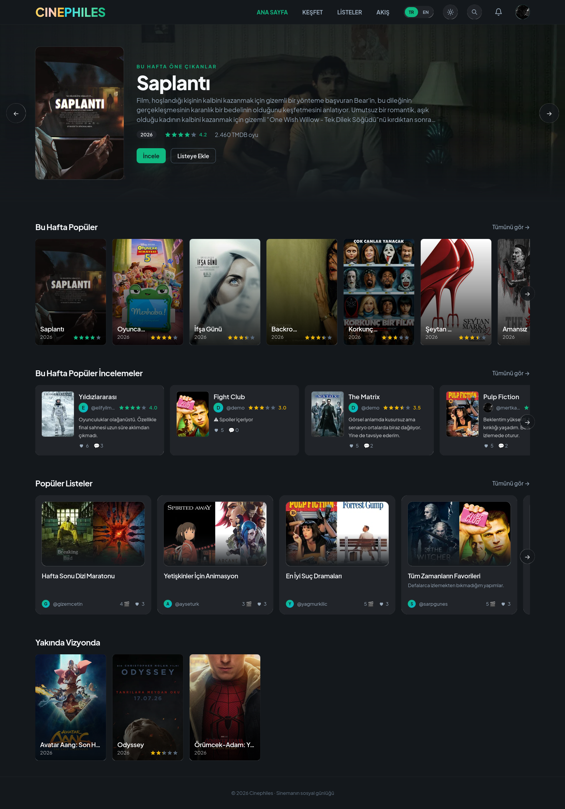
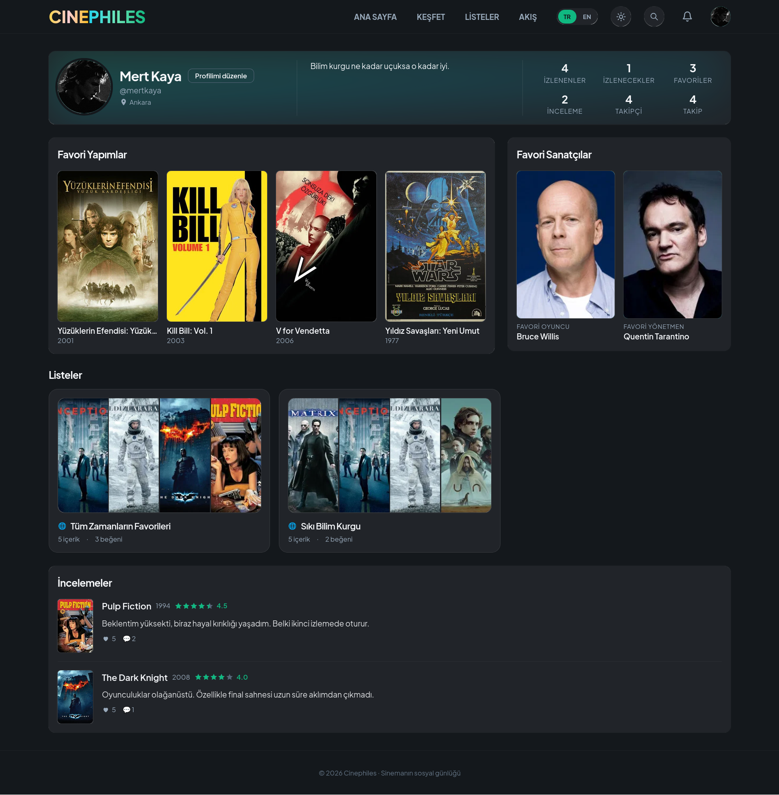

# Cinephiles

> Full-stack social movie & TV review platform powered by TMDB — rate what you
> watch, share spoiler-protected reviews and build your own cinema community.

Cinephiles turns the films and shows you watch into a diary worth sharing. Browse
and search TMDB's catalog, rate titles on a half-star scale, and post
spoiler-protected reviews — then organize everything into Watched, Watchlist,
Favorites and custom lists you can share with others. A social layer of follows,
mentions, an activity feed and in-app notifications keeps the community connected,
while a dedicated admin panel with moderation tools keeps it healthy. It all works
in both Turkish and English, with dark and light themes.

## Features

- **Discover** — browse and search TMDB movies & TV shows; trending, popular and
  upcoming pages; person pages with filmography.
- **Reviews** — 0.5–5 star ratings, spoiler-protected texts, comments, likes and
  a profanity filter.
- **Lists** — Watched / Watchlist / Favorites plus custom lists with drag-and-drop
  ordering and public/private visibility.
- **Social** — follow users, activity feed, `@mentions`, public profiles with
  favorite films, actor and director.
- **Blocking** — blocked users can't follow you, notify you or comment on your reviews.
- **Notifications** — in-app bell with deep links for follows, likes, comments,
  mentions and announcements.
- **Moderation** — report reviews/comments; admins triage them in a report queue.
- **Admin panel** — dashboard & statistics, user/content management with bulk
  actions and CSV export, announcements, audit log.
- **Auth & security** — JWT access/refresh sessions, rate limiting, account
  suspension enforced on every request.
- **UX** — Turkish/English i18n, dark & light themes, responsive design.

## Tech Stack

| Layer | Technology |
|-------|------------|
| **Backend** | Node.js, Express, TypeScript, Prisma (PostgreSQL), Redis |
| **Frontend** | React 18, Vite, TypeScript, Tailwind CSS, React Query, Zustand |
| **Auth** | JWT (access + refresh), bcrypt, rate limiting |
| **Data** | TMDB API (Redis cache), Zod validation |
| **i18n** | i18next (TR/EN) |

## Project Structure

```
movie-review-platform/
├── backend/                 # Express REST API
│   ├── prisma/              # Schema, migrations and seed script
│   └── src/                 # Feature modules (auth, content, users, reviews,
│                            # lists, notifications, admin), middleware,
│                            # services and utils
├── frontend/                # Vite + React SPA
│   ├── public/locales/      # i18n translations (tr / en)
│   └── src/                 # API clients, features, pages
│                            # shared components, hooks and types
├── docker-compose.yml       # PostgreSQL + Redis for local development
└── package.json             # pnpm workspace root
```

## Installation

Requires **Node.js 20+**, **pnpm 9+** and **Docker**.

```bash
# 1. PostgreSQL + Redis
docker compose up -d

# 2. Backend → http://localhost:4000
cd backend
cp .env.example .env       # fill in TMDB_API_KEY and the JWT secrets
pnpm install
pnpm prisma migrate dev
pnpm dev

# 3. Frontend → http://localhost:5173
cd ../frontend
cp .env.example .env
pnpm install
pnpm dev
```

## Screenshots

| Screenshots |
|:-----------:|
| **Home** — spotlight hero, weekly trending titles, popular reviews and community lists |
|  |
| **Content detail** — overview, cast, community ratings and spoiler-aware reviews |
|  |
| **Profile** — user stats, favorite titles & artists, custom lists and reviews |
|  |

## License

This project is licensed under the [MIT License](LICENSE).
